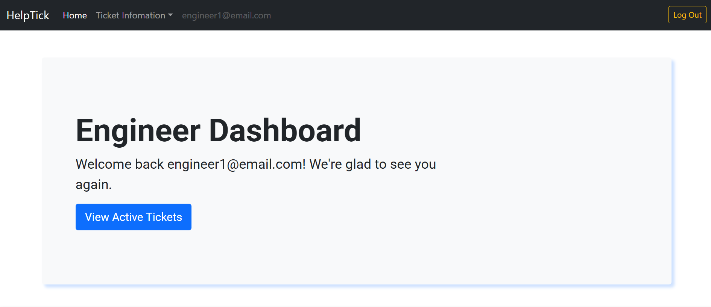
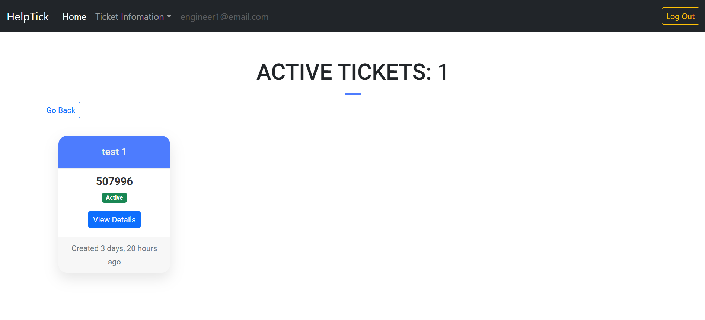
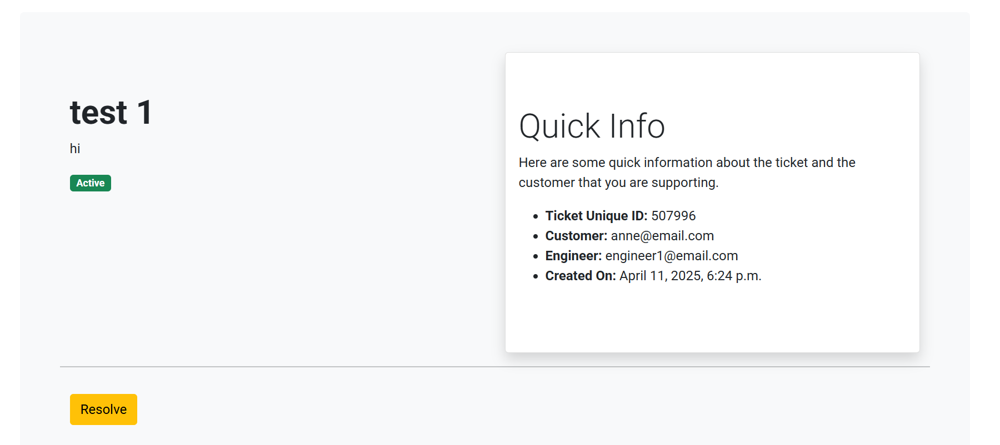
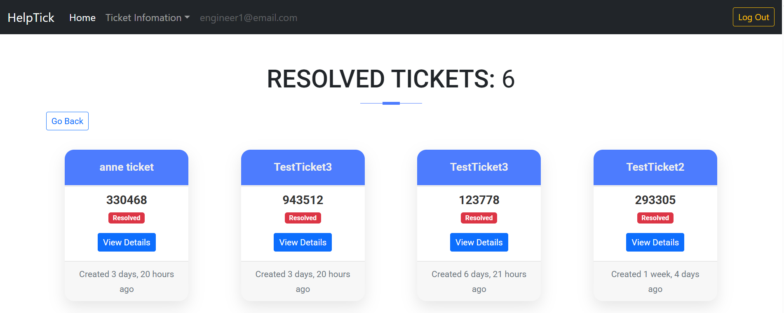
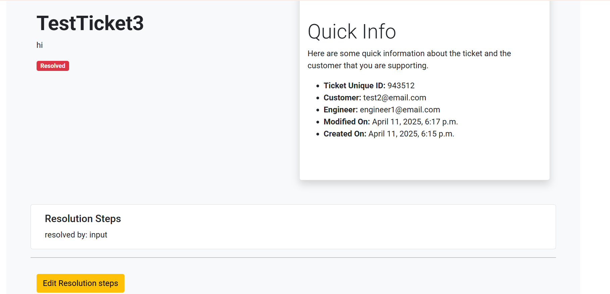
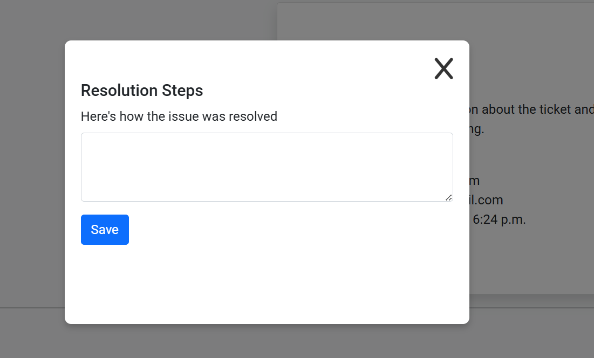

# HelpTick #

## Description ##

HelpTick is an easy-to-use online system that helps customers report technical problems and stay in touch with the support team until the issue is fixed. It lets users quickly create a support ticket, describe the issue in detail, and then track the progress as the engineers work on a solution. Customers get updates along the way, so they always know what’s happening with their request.

For support staff and admins, HelpTick provides a clear dashboard to manage and organize all incoming tickets. They can set priorities, assign tasks, update ticket statuses, and keep notes on how problems were resolved. Everything is designed to make communication smooth, reduce wait times, and help both customers and engineers stay on the same page from start to finish.

## Inspiration 

Another key inspiration for HelpTick was observing the challenges small to mid-sized businesses face when trying to implement structured support systems without investing in complex or expensive tools. Many teams rely on scattered emails, spreadsheets, or informal communication, which often results in missed issues and poor customer satisfaction. HelpTick aims to democratize access to professional support ticketing by offering a simple yet powerful solution that's easy to adopt, customize, and scale — ensuring even smaller teams can provide organized and timely support without getting overwhelmed.

## User Experience

**Project Goals:** The primary goal of HelpTick is to streamline the support process by providing a centralized platform where customers can easily report issues and support teams can efficiently manage and resolve them. The project aims to enhance communication, improve response times, and ensure transparency throughout the ticket lifecycle. By offering role-based dashboards, intuitive forms, and status tracking, HelpTick empowers users to stay informed and engaged. 

### User Story

Beginning the project there was a user story template made, this provided a the fundamentals for the Helptick app to ensure quick development:

**Customer, Admin and Engineer User Story Description**

  

Customers

As a customer, I want to be able to log in and register so that I can use the HelpTick platform.

- I can sign up/register for a HelpTick account.
- I can log in to HelpTick and access my Customer Dashboard.
- I can log out of HelpTick when I’m done using the service.

<ins>Customer Dashboard</ins>

As a customer, I want to access a centralized dashboard to manage my support interactions having access to the customer dashboard after logging in.

The Customer dashboard provides access to:

- Create a new support ticket
- View active (unresolved) tickets
- View resolved tickets

<ins>Create Ticket</ins>

As a customer, I want to be able to submit a ticket when I need help.

- I can fill out a form to create a new ticket.
- The form will have the customer include the ticket title and ticket description.

<ins>Unresolved Tickets</ins>

As a customer, I want to see all open tickets that I have created.

- I can view a list of all unresolved tickets that I’ve submitted.
- I can view the details of each unresolved ticket.
- The tickets are filtered based on their status in the ticket model.

<ins>Resolved Tickets</ins>

As a customer, I want to review tickets that have been completed by the support team.

- I can view all tickets that have been resolved.

<ins>Ticket Details</ins>

As a customer, I want to be able to examine tickets in detail.

- I can view the details of each ticket that I’ve created.
- This will show: title, description, status, modified date.
  

  
Engineers/staff

Engineers can sign up and log in to HelpTick through dedicated authentication pages.

- Enineers can log in to HelpTick and access my Engineers Dashboard.
- Engineers can log out of HelpTick when I’m done using the service.

<ins>Engineer Dashboard</ins>

As a engineer, I want to access a centralized dashboard to manage my support interactions having access to the engineers dashboard after logging in.

The engineers dashboard provides access to:

- View active (unresolved) tickets.
- View resolved tickets.

Engineers can:

- View detailed ticket information submitted by customers.
- Monitor the status and severity of each ticket.
- Access a Resolution Form to provide detailed resolution steps for active tickets.

Once a ticket is resolved:

It moves to the Resolved Tickets section.

- Engineers can still access it for review or auditing purposes.

This workflow ensures engineers can stay organized, prioritize tasks, and maintain efficient communication with customers.

Admin

- As an admin, I can log in to HelpTick and access a dedicated admin dashboard.
- I can view all tickets submitted by customers, regardless of their status (Active, In Progress, Resolved).
- I can assign tickets to engineers based on availability, workload, or expertise.
  

**Project Board**

### Design

**Colours**

Base Colors:

Light Gray Background: **#f8f9fa**

- Often used for soft, light backgrounds like sections or cards.

Light Gray for Borders:**#dee2e6**

- These shades are used for subtle borders, input fields, or secondary elements.

Dark Background (Navbar, Footer): **#343a40**

- Used for darker background areas like the navbar or footer.

Dark Text: **#212529**

- Used for text on dark backgrounds, or for darker, high-contrast text elements.

Blue for border shading:**#007bff**

- Used for texture to make the borders have more enhancement.

**Secondary Colours**

Color: $success: **#28a745**

- Green, used for success actions or to show active tickets.

Warning Button: **#ffc107**

 - Yellow, often used for actions that need attention but aren’t critical like editing tickets.

Danger Button: **#dc3545**

- To show that tickets have been resolved or deletion of tickets.

Primary Buttons: **#007bff**

- These are mainly used throghout the website to naviagte.

### Features

<ins>Authourization Pages</ins>

Login and Register Page:

- The login and register pages features a clean, minimalist design with a centered form that allows users to easily input there details.
- Login Page requires the user to enter their email and password.
- Register Page requires the user to enter email, password and confirm password.

|  Login Page  |  Register Page  |
|:-----|:--------:|
|  | |

<ins>Customer Features</ins>

Customer Dashboard

- Personalized welcome message with user's email
- Option to create a new ticket

Create New Ticket Button

- Simplistic button to navigate to creat new ticket
- 
View Active Tickets

- Display of all currently active tickets
- Each ticket shows title, ticket ID, and creation time
- Buttons to View Details or Delete the ticket

View Resolved Tickets

- Display of all resolved tickets
- Each resolved ticket includes title, ticket ID, creation time
- Buttons to View Details or Delete the ticket

Active/Pending Ticket Details

- Detailed view of a selected ticket
- Includes status, subject, customer email, assigned agent, and timestamps
- Option to delete the ticket

Resolved Ticket Details

- Similar to active ticket detail view
- Displays resolution info, status, and ticket metadata
- Option to delete the ticket

|  Customer Dashboard  |  Create New Ticket  |
|:-----|:--------:|
|  | |
|  **Customers Active Tickets**  |  **Customers Resolved Tickets**  |
|  | |
|  **Customers Active/Pending Tickets Details**  |  **Customers Resolved Ticket Details**  |
|  | |
|  **Delete Tickets**  |  **Edit Tickets**  |
|  |  |

<ins> Adminastrors Features </ins>

Administrators Dashboard

-  Personalized welcome message with user's email.
- Button to view active tickets that have not been resolved.

Ticket Queue

- Page shows all tickets that have not been resolved va table form.
- There is a link on the left that redirects to ticket details.
- Assign ticket button allows the admin to assign ticket to engineer.

Assign Ticket

- Simplistic form design that allows admins to choose from a list of engineers.

Admins Ticket Details

- Ticket detail view
- Displays ticket info, status, and ticket metadata

|  Admins Dashboard  |  Ticket Queue   |
|:-----|:--------:|
|  | |
|  **Assign Ticket**  |  **Admins Ticket Details**  |
|  | |

<ins> Engineer Features </ins>

Engineer Dashboard

- Personalized welcome message with user's email
- Button to view active tickets

Logout button

- Simple button to log out a redirect to login page

View Active Tickets

- Display of all currently active tickets
- Each ticket shows title, ticket ID, and creation time
- Buttons to View Details of the ticket

View Resolved Tickets

- Display of all resolved tickets
- Each resolved ticket includes title, ticket ID, creation time
- Buttons to View Details of the ticket

Active Ticket Details

- Detailed view of a selected ticket
- Includes status, subject, customer email, assigned agent, and timestamps
- Option to resolve the ticket

Resolved Ticket Details

- Similar to active ticket detail view
- Displays resolution info, status, and ticket metadata
- Option to edit the resolution details

|  Engineer Dashboard  | Engineers Active Tickets  |
|:-----|:--------:|
|  | |
|  **Engineer Active ticket Details**  |  **Engineers Resolved Tickets**  |
|  | |
|  **Engineer Resolved Ticket Details**  |  **Resolution Form**  |
|  | |

## Testing

  

User Story Testing

During testing, each story is evaluated to ensure that the implemented feature meets the acceptance criteria and delivers the expected value to the user. This type of testing helps ensure alignment between user expectations and the final product, encourages collaboration between developers, testers, and stakeholders, and supports an agile, behavior-driven development cycle.

|  Story Title  | Acceptance Creteria |  Pass/Fail |
|:-----|:--------:|:--------: |
|  Set up Basics |<ul><li>Create the Helptick apps (ticket, users and dashboards)</li><li>Early deployment for app on Heroku (set up on settings)</li><li>Connect Code Institutes Postgres Database in environment variables</li><li>Hide secret key in environment variables</li></ul> | Pass |
|  Custom User Model  | <ul><li>Add is_engineer and is_customer to the model to identify the differences in the user</li></ul> |  Pass |
|  Ticket Model  | <ul><li>Make sure customers can have many tickets.</li><li>Ticket Title and description for creating tickets. </li> <li>Status of Active, Pending and resolved for active views and resolved views </li></ul> |  Pass |
| Create Superuser | <ul><li>The admin will be able to create an engineer in the admin Screen </li> <li>The admin will be able to edit and modify users and tickets</li><ul> |  Pass |
|  Authentication Pages Customer  | <ul><li>As a customer user I can signup/register for HelpTick.</li><li> As a customer I can login to HelpTick and once registered have access to Customer Dashboard.</li><li>As a customer I can logout of HelpTick after logging in</li></ul>|  Pass |
|  Authentication Pages Engineer  | <ul><li>As a engineer user I can signup/register for HelpTick.</li><li> As a engineer I can login to HelpTick and once registered have to Engineer Dashboard.</li><li>As a engineer I can logout of HelpTick after logging in</li></ul>|  Pass |
|  Authentication Pages Admin  | <ul><li>As a Admin user I can signup/register for HelpTick.</li><li> As a Admin I can login to HelpTick and once registered have to Admin Dashboard.</li><li>As a Admin I can logout of HelpTick after logging in</li></ul>|  Pass |
|  Customer Dashboard  | <ul><li>The customer can access customer dashboard</li><li>The customer dashboard will give access to creating tickets, view active/unresolved tickets and resolved tickets</li></ul> |  Pass |
|  Admin Dashboard  | <ul><li>As the admin I can access the admin dashboard</li><li>The Admin dashboard will give access to all tickets that have not been assigned engineers called 'Ticket Queue'</li></ul>|  Pass |
|  Engineer Dashboard  | <ul><li>As the engineer I can access the engineers dashboard</li><li>The engineer dashboard will give access to all tickets that have been assigned to that specific engineer</li><li>The engineer dashboard will give access to all previously resolved tickets by that specific engineer</li></ul>|  Pass |
|  Create Ticket  | <ul><li>Creating a ticket will require a form</li><li>Creating a ticket will require the customer to provide a ticket title</li><li>Creating a ticket will require a description of the problem the user has</li></ul> |  Pass |
|  Unresolved tickets  | <ul><li>As an customer I can view all tickets that I have created which will be filtered on the tickets model</li><li>As a customer I can access the ticket details that have populated</li></ul> |  Pass |
| Ticket Queue  | <ul><li>This will require filtering on the tickets model where engineer is not assigned</li></ul> |  Pass |
|  Assign Ticket  | <ul><li>The form will need to include a list of all engineers that have been created system</li><ul> |  Pass |
|  Unresolved Tickets Engineer  | <ul><li>As an engineer I can view all tickets assigned to me - which will be filtered on the tickets model</li><li>As a engineer I access view the ticket detail in order to resolve</li><ul> |  Pass |
|  Unresolved Ticket Details Customer  | <ul><li>The customer can view a detailed ticket that has not been resolved</li><ul> |  Pass |
|  Resolution Form  | <ul><li>Resolution form will need resolution steps</li><ul> |  Pass |
|  Ticket Details Engineer  | <ul><li>As an engineer I can view the tickets details that have been populated by the customer</li><li> As an engineer I can choose to resolve the ticket</li><ul> |  Pass |
|  Resolved Tickets engineer | <ul><li>As an engineer I can view all tickets resolved by me which will be filtered on the tickets model</li><li>As a engineer I can view the ticket detail in order to edit resolution</li><ul> |  Pass |
|  Resolved Tickets Customer | <ul><li>As a customer I will be able to view the details of these resolved tickets</li><ul> |  Pass |

**Manual Testing**

<ins>Login Page</ins>

 Login Page Tests 

  
`Page Load:`
- Ensure login Page loads correctly with all bootstrap and custom CSS. **(Pass)**
    
 `Form Load:`
- Ensure the login form and all its components load correctly on the page. **(Pass)**

 `Valid Login:`
- Input a correct username/email and password.
  - Expected Result: Successful login and redirection to the dashboard or home screen. **(Pass)**

`Invalid Credentials:`
- Input an incorrect username/email or password.
  - Expected Result: An appropriate error message is displayed  **(Pass)**

`Empty Fields:`
- Attempt to log in without entering any values.
  - Expected Result: Validation errors should prompt the user to fill in the fields. **(Pass)**
  
`Email Format Validation:`
- Input an invalid email format (e.g., userexample.com)
  - Expected Result: Frontend validation should prevent form submission **(Pass)**

<ins>Register Page</ins>

 Register Page Tests 

`Page Load:`
- Ensure login Page loads correctly with all bootstrap and custom CSS. **(Pass)**

 `Form Load:`
  - Ensure the login form and all its components load correctly on the page. **(Pass)**

`Valid Registration:`
- Fill out the form with valid data in all fields.
  - Expected Result: Account is successfully created, and user is redirected to the login page. **(Pass)**

`Empty Fields:`

- Submit the form with one or more fields left empty.
  - Expected Result: Validation errors prompt the user to complete all required fields.**(Pass)**

`Email Format Validation:`

- Enter an improperly formatted email (e.g., user@com, user.com).
  - Expected Result: The system should block submission and show a validation message.**(Pass)**

`Password Confirmation Mismatch:`

- Enter different values in the password and confirm password fields.
  - Expected Result: The form should not submit and display an error.**(Pass)**

<ins>Customer Dashboard</ins>

Customer Dashboard Tests

`Dashboard Load`
- Ensure the dashboard loads successfully after customer login.
  - Expected Result: navigation menus and content appear without errors. **(Pass)**

`Welcome Message`
- Verify that the dashboard displays a personalized welcome message including the user email. **(Pass)**

`Create New Ticket`

- Ensure once button is clicked it will show the create new ticket form. **(Pass)**
- Ensure that both ticket title and ticket details need to be filled out in order to submit a new ticket. **(Pass)**
- Ensure the the go back button will take you back to the page you were previously on. **(Pass)**
- Once titcket form is valid ensure the submit button creates a new ticket (this can be viewd on the active tickets page). **(Pass)**

`Navigation bar`

- Responsive Behavior: Resize the browser or use a mobile device to test responsiveness.
  - Expected Result: Navbar collapses into a hamburger menu or adjusts layout cleanly. **(Pass)**
- Links Routing: Click each nav item (e.g., HelpTick logo, Active Tickets, Resolved Tickets and Logout) and confirm redirection.
  - Expected Result: Pages load correctly with appropriate content. **(Pass)**
- Logout Button Test the logout link or button from the navbar.
  - Expected Result: User is securely logged out and redirected to the login page. **(Pass)**

<ins>Customer Active Tickets</ins>

Customer Active Tickets Test

`Ticket List Visibility`
- Expected Result: Active tickets are listed in a card layout with clear ticket titles and status badges. **(Pass)**

`Status Filtering`
- Confirm only tickets with status Pending or Active are shown in the “Active Tickets” section.
- Expected Result: Tickets marked as Resolved are not visible in this section. **(Pass)**

`Ticket Details Navigation`

- Click on a ticket to view more details.
- Expected Result: Redirects to a detailed ticket view with description, creation date, and status.

`Responsiveness`
- View the active tickets section on various devices (desktop, tablet, mobile).
- Expected Result: The layout adjusts gracefully without breaking or hiding information. **(Pass)**

<ins>Ticket Deatails Active/Pending<ins>

Ticket Details Active /Pending Page Tests

`Ticket Information Display`
- View the ticket's title, description, unique ID, customer, engineer, creation date, and severity.

`Responsive Design`
- View the ticket details on different screen sizes.
- Expected Result: Layout remains clean and information is readable across all devices. **(Pass)**

`Edit Description`
- Click edit button to ensure form loads correctly. 
- Ensure customer cannot submit form without the form being filled out. **(Pass)**
- Click on the bo back button to ensure it takes you to the previuos page visited. **(Pass)**

`Delete Button`
- Ensure once clicked on delete button it navigates you to a confirmation page. **(Pass)**
- Ensure the cancel button naviagtes you back to the active tickets. **(Pass)**
- Ensure the submit button deletes the ticket and is not longer viewed on active tickets. **(Pass)**

<ins>Customer Resolved Tickets</ins>

Customer Resolved Tickets Test

`Ticket List Visibility`
- Expected Result: Active tickets are listed in a card layout with clear ticket titles and status badges. **(Pass)**

`Status Filtering`
- Confirm only tickets with status Pending or Active are shown in the “Resolved Tickets” section.
- Expected Result: Tickets marked as Active or Pending are not visible in this section. **(Pass)**

`Ticket Details Navigation`

- Click on a ticket to view more details.
- Expected Result: Redirects to a detailed ticket view with description, creation date, and status. **(Pass)**

`Responsiveness`
- View the active tickets section on various devices (desktop, tablet, mobile).
- Expected Result: The layout adjusts gracefully without breaking or hiding information. **(Pass)**

<ins>Ticket Details Resoloved Page</ins>

  

Ticket Details Resolved Page Tests

`Ticket Information Display`
- View the ticket's title, description, unique ID, customer, engineer, creation date, and severity.**(Pass)**

`Responsive Design`
- View the ticket details on different screen sizes.
- Expected Result: Layout remains clean and information is readable across all devices. **(Pass)**

`Delete Button`
- Ensure once clicked on delete button it navigates you to a confirmation page. **(Pass)**
- Ensure the cancel button naviagtes you back to the active tickets. **(Pass)**
- Ensure the submit button deletes the ticket and is not longer viewed on resolved tickets. **(Pass)**

`No Edit Ability`
- Ensure Oncecrolevd the customer can no longer edit the ticke unlike active or pending. **(Pass)**
- 

