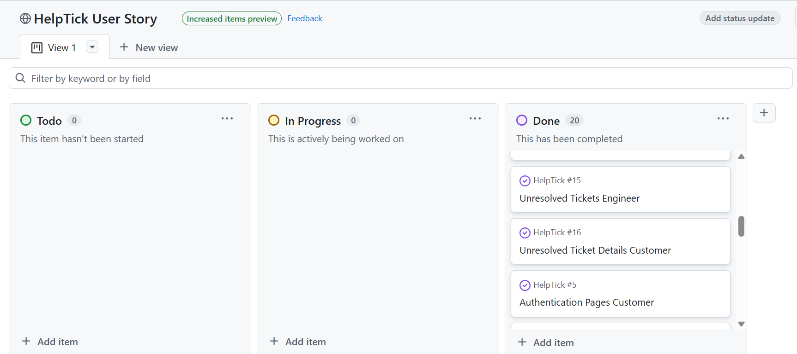
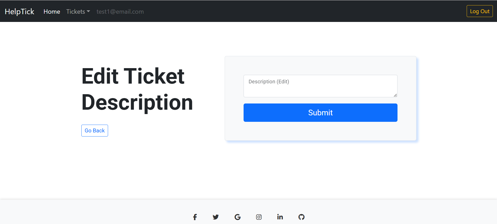
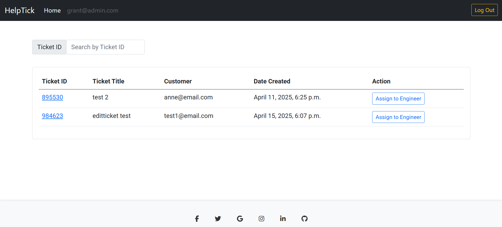

# HelpTick #

## Description ##

HelpTick is an easy-to-use online system that helps customers report technical problems and stay in touch with the support team until the issue is fixed. It lets users quickly create a support ticket, describe the issue in detail, and then track the progress as the engineers work on a solution. Customers get updates along the way, so they always know what’s happening with their request.

For support staff and admins, HelpTick provides a clear dashboard to manage and organize all incoming tickets. They can set priorities, assign tasks, update ticket statuses, and keep notes on how problems were resolved. Everything is designed to make communication smooth, reduce wait times, and help both customers and engineers stay on the same page from start to finish.

## Inspiration 

Another key inspiration for HelpTick was observing the challenges small to mid-sized businesses face when trying to implement structured support systems without investing in complex or expensive tools. Many teams rely on scattered emails, spreadsheets, or informal communication, which often results in missed issues and poor customer satisfaction. HelpTick aims to democratize access to professional support ticketing by offering a simple yet powerful solution that's easy to adopt, customize, and scale — ensuring even smaller teams can provide organized and timely support without getting overwhelmed.

## User Experience

**Project Goals:** The primary goal of HelpTick is to streamline the support process by providing a centralized platform where customers can easily report issues and support teams can efficiently manage and resolve them. The project aims to enhance communication, improve response times, and ensure transparency throughout the ticket lifecycle. By offering role-based dashboards, intuitive forms, and status tracking, HelpTick empowers users to stay informed and engaged. 

### User Story

Beginning the project there was a user story template made, this provided a the fundamentals for the Helptick app to ensure quick development:

**Customer, Admin and Engineer User Story Description**

  

Customers

As a customer, I want to be able to log in and register so that I can use the HelpTick platform.

- I can sign up/register for a HelpTick account.
- I can log in to HelpTick and access my Customer Dashboard.
- I can log out of HelpTick when I’m done using the service.

<ins>Customer Dashboard</ins>

As a customer, I want to access a centralized dashboard to manage my support interactions having access to the customer dashboard after logging in.

The Customer dashboard provides access to:

- Create a new support ticket
- View active (unresolved) tickets
- View resolved tickets

<ins>Create Ticket</ins>

As a customer, I want to be able to submit a ticket when I need help.

- I can fill out a form to create a new ticket.
- The form will have the customer include the ticket title and ticket description.

<ins>Unresolved Tickets</ins>

As a customer, I want to see all open tickets that I have created.

- I can view a list of all unresolved tickets that I’ve submitted.
- I can view the details of each unresolved ticket.
- The tickets are filtered based on their status in the ticket model.

<ins>Resolved Tickets</ins>

As a customer, I want to review tickets that have been completed by the support team.

- I can view all tickets that have been resolved.

<ins>Ticket Details</ins>

As a customer, I want to be able to examine tickets in detail.

- I can view the details of each ticket that I’ve created.
- This will show: title, description, status, modified date.
  

  
Engineers/staff

Engineers can sign up and log in to HelpTick through dedicated authentication pages.

- Enineers can log in to HelpTick and access my Engineers Dashboard.
- Engineers can log out of HelpTick when I’m done using the service.

<ins>Engineer Dashboard</ins>

As a engineer, I want to access a centralized dashboard to manage my support interactions having access to the engineers dashboard after logging in.

The engineers dashboard provides access to:

- View active (unresolved) tickets.
- View resolved tickets.

Engineers can:

- View detailed ticket information submitted by customers.
- Monitor the status and severity of each ticket.
- Access a Resolution Form to provide detailed resolution steps for active tickets.

Once a ticket is resolved:

It moves to the Resolved Tickets section.

- Engineers can still access it for review or auditing purposes.

This workflow ensures engineers can stay organized, prioritize tasks, and maintain efficient communication with customers.

Admin

- As an admin, I can log in to HelpTick and access a dedicated admin dashboard.
- I can view all tickets submitted by customers, regardless of their status (Active, In Progress, Resolved).
- I can assign tickets to engineers based on availability, workload, or expertise.
  

**Project Board**

### Design

**Colours**

Base Colors:

Light Gray Background: **#f8f9fa**

- Often used for soft, light backgrounds like sections or cards.

Light Gray for Borders:**#dee2e6**

- These shades are used for subtle borders, input fields, or secondary elements.

Dark Background (Navbar, Footer): **#343a40**

- Used for darker background areas like the navbar or footer.

Dark Text: **#212529**

- Used for text on dark backgrounds, or for darker, high-contrast text elements.

Blue for border shading:**#007bff**

- Used for texture to make the borders have more enhancement.

**Secondary Colours**

Color: $success: **#28a745**

- Green, used for success actions or to show active tickets.

Warning Button: **#ffc107**

 - Yellow, often used for actions that need attention but aren’t critical like editing tickets.

Danger Button: **#dc3545**

- To show that tickets have been resolved or deletion of tickets.

Primary Buttons: **#007bff**

- These are mainly used throghout the website to naviagte.

### Features

<ins>Authourization Pages</ins>

Login and Register Page:

- The login and register pages features a clean, minimalist design with a centered form that allows users to easily input there details.
- Login Page requires the user to enter their email and password.
- Register Page requires the user to enter email, password and confirm password.

|  Login Page  |  Register Page  |
|:-----|:--------:|
|  | |

<ins>Customer Features</ins>

Customer Dashboard

- Personalized welcome message with user's email
- Option to create a new ticket

Logout button

- Register / Create New Ticket Page
- Simple form to input ticket title and description
- "Submit" button to create a ticket

View Active Tickets

- Display of all currently active tickets
- Each ticket shows title, ticket ID, and creation time
- Buttons to View Details or Delete the ticket

View Resolved Tickets

- Display of all resolved tickets
- Each resolved ticket includes title, ticket ID, creation time
- Buttons to View Details or Delete the ticket

Active/Pending Ticket Details

- Detailed view of a selected ticket
- Includes status, subject, customer email, assigned agent, and timestamps
- Option to delete the ticket

Resolved Ticket Details

- Similar to active ticket detail view
- Displays resolution info, status, and ticket metadata
- Option to delete the ticket

|  Customer Dashboard  |  Register Page  |
|:-----|:--------:|
|  | |
|  **Customers Active Tickets**  |  **Customers Resolved Tickets**  |
|  | |
|  **Customers Active/Pending Tickets Details**  |  **Customers Resolved Ticket Details**  |
|  | |
|  **Delete Tickets**  |  **Edit Tickets**  |
|  |  |

<ins> Adminastrors Features </ins>
|  Admins Dashboard  |  Ticket Queue   |
|:-----|:--------:|
|  | |
|  **Assign Ticket**  |  **Admins Ticket Details**  |
|  | |
